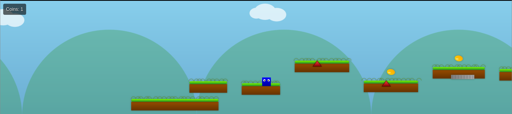

# 🎮 Platformer Game

Welcome to the **Platformer Game**! 🎉 In this game, you will control a player character 🧑‍💻 navigating through procedurally generated levels filled with platforms, coins, and hazards. Your goal is to reach the end of the level while collecting as many coins as possible! 💰

## 🚀 Features

- **Procedurally Generated Levels:** Each time you play, the level layout changes, providing a new experience! 🔄
- **Coins to Collect:** Gather coins scattered around the level to increase your score! 💵
- **Hazards:** Be careful! Hitting hazards will make you start over. ⚠️
- **Moving Platforms:** Some platforms move, adding an extra challenge. 🚧
- **Goal:** Reach the end goal to complete the level! 🏁
- **Game Over Screen:** If you fall or hit a hazard, you'll see a "Game Over" message. 💥

## 🕹️ Controls

- **Arrow Keys:** Move left, right or jump 🚀

## 🌟 How to Play

1. **Start the Game:** Open the `index.html` file in your browser.
2. **Move:** Use the left and right arrow keys to move, and space to jump over obstacles.
3. **Collect Coins:** Try to collect as many coins as possible as you progress.
4. **Avoid Hazards:** Watch out for hazards! If you touch them, it's game over. ⚡
5. **Reach the Goal:** Once you reach the end goal, you'll win the level! 🎉

## 🔧 Installation

1. Clone or download the repository.
2. Open the `index.html` file in a modern browser (e.g., Chrome, Firefox).
3. Start playing! 🎮

## 💬 Contributions

Feel free to fork this project and make improvements! Contributions are always welcome. 🙌

## 🤝 License

This project is licensed under the MIT License - see the [LICENSE](LICENSE) file for details.
